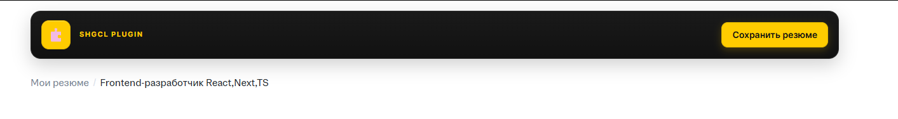
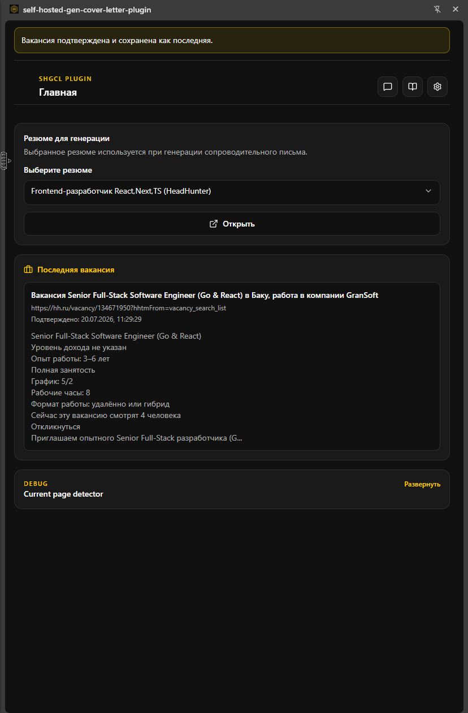
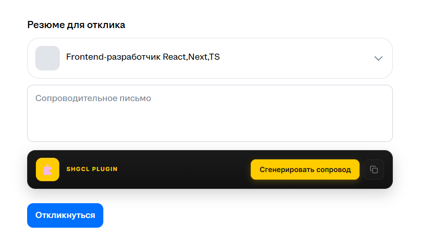

# Self-Hosted Gen Cover Letter Plugin (SHGCL)

Браузерное расширение (Chrome MV3), которое помогает сохранять резюме, подтягивать вакансии и генерировать сопроводительные письма через **вашу** LLM — локальную (LM Studio и аналоги) или облачную OpenAI-compatible API.

По умолчанию из коробки настроен [hh.ru](https://hh.ru). Другие job-сайты можно добавить в настройках через regex URL и CSS-селекторы. Готовые конфиги платформ можно обменивать через буфер обмена.

## Что умеет

- Подключение к любой OpenAI-compatible LLM (LM Studio, OpenAI и т.п.)
- Парсинг и сохранение резюме со страницы сайта
- Автопарсинг вакансии и генерация сопроводительного с вставкой в поле отклика
- Настраиваемые промпты (письмо, парсинг резюме, быстрый чат)
- Несколько платформ (сайтов) с regex/CSS-конфигом
- Импорт/экспорт конфига платформы через clipboard
- Side panel UI + кнопки на страницах

Подробный флоу — во вкладке **Гайд** внутри расширения.

## Требования

- Google Chrome / Chromium (или Edge на Chromium)
- Node.js 20+ (только если собираете из исходников)
- Запущенная LLM с OpenAI-compatible endpoint (например LM Studio на `http://localhost:1234/v1`)

## Установка из релиза (без сборки)

После `npm run build` в папке `release/` появляется архив вида:

```text
release/crx-self-hosted-gen-cover-letter-plugin-1.0.0.zip
```

1. Скачайте zip из `release/` (из репозитория / Releases / у автора).
2. Распакуйте архив в любую папку.
3. Откройте `chrome://extensions/`.
4. Включите **«Режим разработчика»** (Developer mode).
5. Нажмите **«Загрузить распакованное расширение»** (Load unpacked).
6. Укажите **распакованную папку** (внутри должен быть `manifest.json`).

Готово. Иконка появится на панели; основной UI — в **боковой панели** (side panel).

> Если обновляете версию: удалите старое расширение или загрузите новую папку поверх и нажмите «Обновить» на карточке расширения. После обновления обновите вкладки job-сайтов.

## Установка из исходников

```bash
git clone <url-репозитория>
cd hh-free-cheat   # или имя вашей папки клона

npm install
npm run build
```

Сборка кладёт готовое расширение в `dist/`, zip — в `release/`.

Дальше как выше: `chrome://extensions/` → режим разработчика → **Load unpacked** → выберите папку **`dist`**.

### Разработка

```bash
npm run dev
```

Затем загрузите unpacked из `dist` (CRXJS обновляет её на лету). После правок иногда нужна перезагрузка расширения на `chrome://extensions/`.

## Первая настройка

1. Откройте side panel расширения.
2. **Настройки → LLM**: base URL, API key, модель.
3. Нажмите **«Проверить подключение»**.
4. По желанию поправьте промпт сопроводительного и подпись.
5. **Сохранить конфиги**.

Для LM Studio обычно:

| Поле     | Значение                     |
| -------- | ---------------------------- |
| Base URL | `http://localhost:1234/v1`   |
| API key  | любое (например `lm-studio`) |
| Model    | id модели из LM Studio       |

## Быстрый сценарий (hh.ru)

1. Откройте своё резюме → кнопка **«Сохранить резюме»** на странице → резюме уйдёт в LLM и сохранится в расширении.

    

2. Откройте вакансию → текст подтянется в side panel на главной.

    

3. На форме отклика → **«Сгенерировать сопровод»** → текст вставится в поле (или скопируйте кнопкой рядом, если сайт с кастомным редактором).

    

## Обмен конфигами сайтов

В **Настройки → Контент** на карточке платформы:

- стрелка вверх — скопировать JSON конфига в буфер;
- стрелка вниз — вставить из буфера (с подтверждением);
- затем **«Сохранить конфиги»**.

Формат:

```json
{
    "type": "SHG-content-platform",
    "version": 1,
    "platform": {}
}
```

Принимается и старый type `hh-free-cheat-content-platform`, и голый объект `platform`.

## Структура репозитория

```text
docs/
  img/         — скриншоты для README
license/       — отказ от ответственности (Disclaimer)
src/
  sidepanel/   — UI боковой панели
  content/     — инжект на страницах сайтов
  background/  — service worker
  lib/         — API LLM, конфиги, типы
manifest.config.ts
dist/          — собранное расширение (Load unpacked)
release/       — zip для раздачи без сборки
```

## Лицензия / использование

Проект распространяется под **MIT License**. Данные резюме и вакансий уходят только на указанный вами LLM endpoint — магазин Chrome и сторонние серверы автора не участвуют.

Полный **[отказ от ответственности (Disclaimer)](license/README.md)** — в папке `license/`. Тот же текст доступен внутри расширения на главной (плашка → отдельный экран).

## Тестовая конфигурация

Проверено автором на следующей связке железо + локальная LLM:

|                   |                                                              |
| ----------------- | ------------------------------------------------------------ |
| ОС                | Windows 11 Pro (Build 22631)                                 |
| CPU               | AMD Ryzen 5 7600X                                            |
| RAM               | 32 GB                                                        |
| GPU               | NVIDIA GeForce RTX 5060 Ti 16 GB (driver 610.47)             |
| Материнская плата | ASRock B650M-HDV/M.2                                         |
| LLM               | `hauhaucsgemma4-12b-qat-uncensored-hauhaucs-balanced@q4_k_m` |

Это ориентир, а не требование: расширение работает с любым OpenAI-compatible / Anthropic Messages endpoint.
